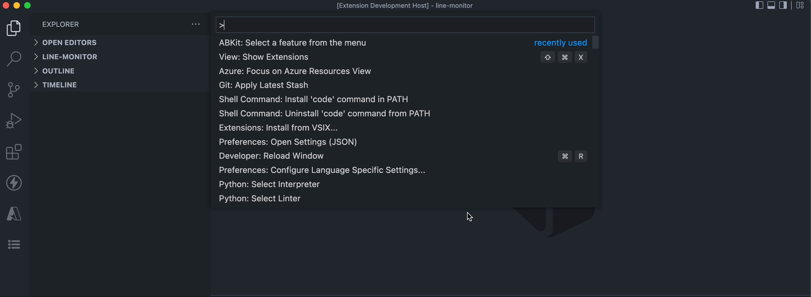

# Accessibility Testkit

Accessibility Testkit (ABKit) is a menu-driven extension that allows users to quickly demo a small subset of VSCode's
common UI features with different base configuration sets.  ABKit's fast feature demo'ing enables the user to quickly check
UI configurations for screen reader compliance.

## Getting Started

Option 1: Search for and install ABKit from VSCode's Extension Marketplace.

Option 2: Clone the repo and run 'npm install'

Open the command pallette and type in "abkit".  The menu command should pop up.

Finally, choose a menu item to demo.

## Features

1. Quick Picks
  * Show Quick Picks Method - Single Selection
  * Show Quick Picks Method - Multiple Selection
  * Create Quick Picks Method - Single Selection
  * Create Quick Picks Method - Multiple Selection

2. Input Box
  * Show Input Box Method - Without Password
  * Show Input Box Method - With Password
  * Create Input Box Method - Without Password
  * Create Input Box Method - With Password

3. Tree View
  * Main Toolbar Icon Commands - Insert, Refresh, Clear
  * Inline Toolbar Icons (Placeholders) - Edit, Delete

## Demo a Change to Existing Feature

1. Clone the repository
2. Install dependencies (npm install)
3. Optional - Create a branch (`git checkout -b <testBranchName>`)
4. Navigate to "src/components/".  These are the list of the current VSCode UI features.
5. Open the UI feature folder of choice, and find your creation method. Open the file, make changes to your feature, then save.
6. Run the change with F5 in the Extension Host mode, following the instructions in the Getting Started section.

## Adding a Change to Existing Feature

Coming soon...